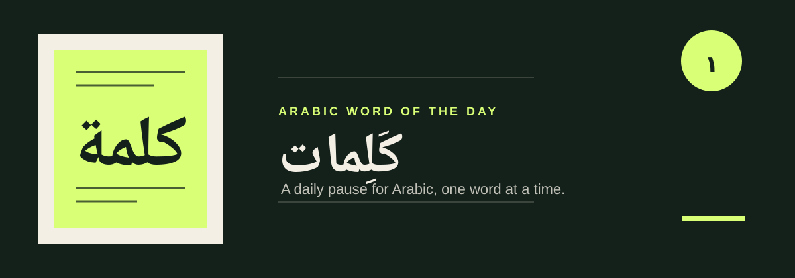

<div align="center" dir="rtl">



# كَلِمات

### كلمة عربية واحدة كل يوم، تُقرأ على مهل.

تجربة خفيفة لعشّاق العربية: معنى، ضبط، جذر، مثال، ونطق في صفحة واحدة هادئة.

*A calm, Arabic-first daily reading experience for one word at a time.*

<kbd>HTML</kbd> <kbd>CSS</kbd> <kbd>JavaScript</kbd> <kbd>No build step</kbd> <kbd>Local-first privacy</kbd>

[ابدأ من الصفحة الرئيسية](index.html) · [افتح كلمة اليوم](word.html) · English below

</div>

## ما الذي تقرؤه؟

| في اللحظة | ما وراء الكلمة |
| --- | --- |
| **كلمة اليوم**<br>اختيار ثابت للجميع في التاريخ المحلي نفسه. | **بنيتها**<br>الضبط، الوزن، الجذر، والتصنيف. |
| **صوتها وسياقها**<br>نطق المتصفح، معنى موجز، ومثال حي. | **أثرك الشخصي**<br>سجل محلي للكلمات التي مررت بها، مع مشاركة ونسخ. |

## الخصوصية وسجل التعلّم

لا حسابات، ولا قاعدة بيانات، ولا تحليلات. يبقى سجلّك وتفضيل إظهار المعنى الإنجليزي في `localStorage` داخل متصفحك.

يمكنك تصدير السجل إلى ملف JSON ثم استيراده على جهاز آخر. الاستيراد يدمج السجلين ولا يحذف ما لديك، ويحتفظ بأقدم تاريخ ظهور للكلمة المشتركة.

### حدود الموقع والامتداد · Website and extension boundary

يحفظ الموقع سجل القراءة في `localStorage`، بينما يحفظ امتداد MV3 ملف المتعلّم في `storage.local`. هذان مخزنان محليان منفصلان؛ لا يتزامن السجل أو التعيينات بينهما تلقائيًا. لمزيد من التفاصيل عن بحث Chrome الاختياري في Wiktionary، راجع [سياسة خصوصية الامتداد](extension/PRIVACY.md).

The website stores reading history in `localStorage`; the MV3 extension stores its learner profile in `storage.local`. These are separate local stores, so history and assignments do not sync automatically. See the [extension privacy policy](extension/PRIVACY.md) for the optional Chrome Wiktionary lookup boundary.

## تشغيل محليًا

يتطلب المشروع Python 3 فقط:

```powershell
git clone https://github.com/Assem130/arabic-word-of-the-day.git
cd arabic-word-of-the-day
python server.py
```

افتح <http://localhost:8000>. الخادم المرفق يضيف ترويسات UTF-8 لملفات التطبيق النصية على Windows.

للتأكد من السلوك الأساسي:

```powershell
node test.js
git diff --check
```

## خريطة المشروع

```text
index.html       صفحة البداية التحريرية
word.html        تجربة كلمة اليوم وعناصر التحكم
words.js         قاعدة الكلمات العربية المضمّنة
app-core.js      اختيار الكلمة وحالة النسخ الاحتياطي
app.js           العرض والسجل والنطق والمشاركة والاستيراد والتصدير
revamp.js        حركة صفحة البداية
server.py        خادم تطوير محلي بترويسات UTF-8
test.js          اختبارات بلا اعتماديات
assets/          أصول العرض الخاصة بالمستودع
```

## Kalimat - Arabic Word of the Day

Kalimat is a no-build, two-page Arabic learning experience. The landing page leads into a daily word with its vocalization, pattern, root, category, meaning, pronunciation, example, and a countdown to tomorrow.

Everything personal stays in the browser. Exported JSON archives are portable and merge safely on import, so a learner can move their reading history without creating an account.
